# IOT система

## Требования к системе

### 1. Максимальное количество пользователей, поддерживаемых в каждый момент времени:

- Ожидаемое количество одновременных сессий: 10000 (примерное количество устройств, которое может находиться в большом
  задании/офисе)
- Количество пользователей, активно взаимодействующих с приложением в реальном времени: 2000 (примерное количество
  сотрудников офиса, которые могут пользоваться iot единовременно)

### 2. Требуемая скорость обработки запросов:

- Время отклика на запросы пользователей (например, время ответа API): 2 секунды (приемлемое время откклика для
  человеческого восприятия)
- Время обработки запросов на уровне базы данных и взаимодействия между сервисами: 1.5 секунды (тк закладывается резерв
  под время обработки бизнесс логикой)

### 3. Объем хранимой информации:

- Прогнозируемый объем данных на старте: 0 (на с старте у приложения нет логов и данных)
- Возможный рост объема данных с течением времени, включая логи, пользовательские данные и контент: прирос 20 гб/час (
  расчитано на основе того, что один активный пользователь делает 1 запрос в секунду)
  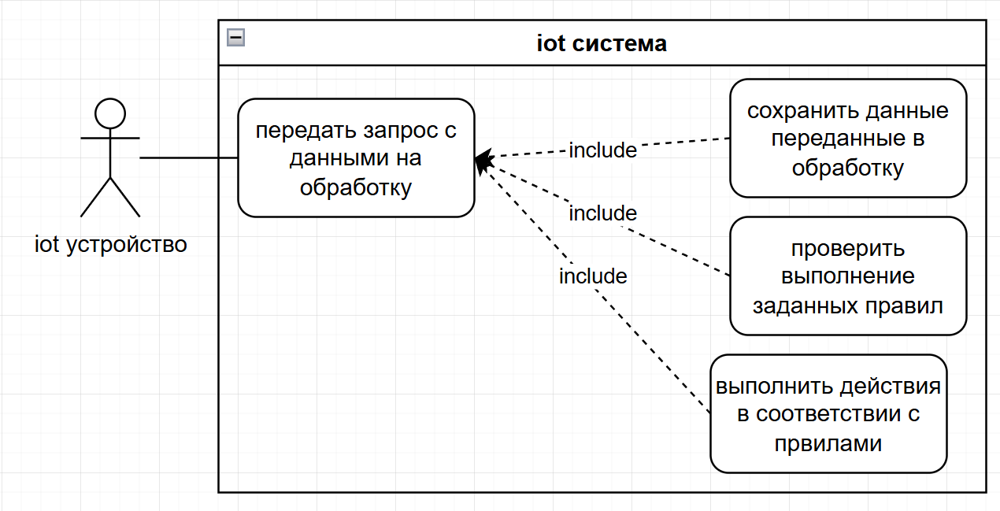

## Архитектура системы

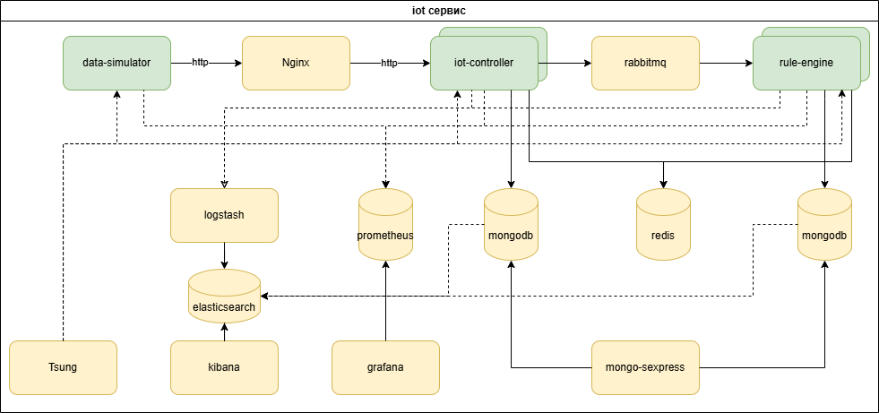

Архитектура приложения состоит из трех сервисов: data-simulator, controller, rule-engine и инфраструктурных сервисов:
mongodb, mongo-express, rabbitmq, grafana, prometheus, elasticsearch, logstash, kibana. Собственные сервисы написаны на
языке программирования java с использованием фреймворка spring boot. Далее будут рассмотрены все сервисы.

### Собственные сервисы:

- data-simulator - сервис для генерации входных данных. Эмулирует поведение группы сервисов iot-системы отвечающих за
  генерацию данных в системе. В конфигурациях сервиса задается информация о количестве устройств, которые он эмулирует и
  частоте генерации ими сообщений, помимо этого есть возможность задать набор доступных имен и генерируемых значений.
  Генерируемые данные представляются в виде json-объектов с рандомным набором полей (из списка доступных полей) и
  значений.
- controller - сервис представляет собой входную точку в системе управления iot. Принимая данные от устройств (
  эмулируемые сервисом data-simulator), он валидирует их, сохраняет в mongodb, передает в очередь сообщений rabbitmq.
  Помимо этого
  используется для отслеживания метрик и состояния.

- rule-engine - сервис обработки входящих сообщений на выполнение динамически задаваемых правил. Принимает сообщения с
  помощью прослушивания очереди RabbitMQ, сохраняет результаты проверки в MongoDB.

### Инфраструктурные сервисы:

- mongodb/mongo-express - NoSQL база данных и интерфейс взаимодействия с ней. MongoDb была создана в двух экземплярах
  для сервисов controller и rule-engine. Сделано это было для сохранения принципа один сервис - одна база данных. Ниже
  будет приведена общая конфигурация для всех сервисов.
- rabbitmq - очередь обмена сообщениями, используемая для передачи пакетов данных от controller в rule-engine.
- grafana/prometheus - набор инструментов для работы с метриками. Grafana - инструмент для отображения данных,
  получаемых от datasource, в нашем случае datasource - это prometheus. Prometheus получает данные от каждого сервиса (
  для чего используется spring actuator). Все сервисы транслируют свои метрики одновременно, на grafana есть возможность
  указать данные какого сервиса необходимо мониторить. Среди прочих системных метрик есть отображение количества
  выполненных правил.
- elasticsearch/logstash/kibana - стек инструментов для хранения, обработки, фильтрации и визуализации логов.
  Elasticsearch - хранит логи по индексам. Logstash - принимает логи от beats, фильтрует и трансформирует их перед
  отправкой в elasticsearch. kibana - визуализирует логи, собирая их из elasticsearch. Каждый сервис подключен к этому
  стеку и отправляет туда логи по порту 5000. Для этого в logstash настроен пайплайн, который фильтрует по хосту.
- Redis - система управления NoSQL базами данных для работы с кэшами
- Tsung - система для проведения нагрузочного/стресс-тестирования 

## Масштабирование

Для тестирования масштабирования был разработан следующий сценарий:
- На протяжении 30 секунд каждую 0.1 секунды создавался новый пользователь
- Каждый пользователь делал по 300 запросов каждые 0.1 секунды
Таким образом на дальнейших графиках будет заметно,
что первые 30 секунд нагрузка растёт, а остаток времени - уменьшается

### Вертикальное масштабирование
Тестирование вертикального масштабирования происходило в два этапа:
1) Были выбраны минимальные допустимые конфигурации системы для запуска нагрузочного тестирования
- mem = 1g
- cpu = 1
При таких настройках было проведено нагрузочное тестирование
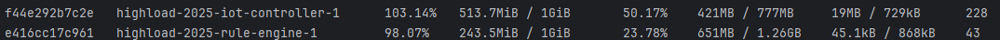
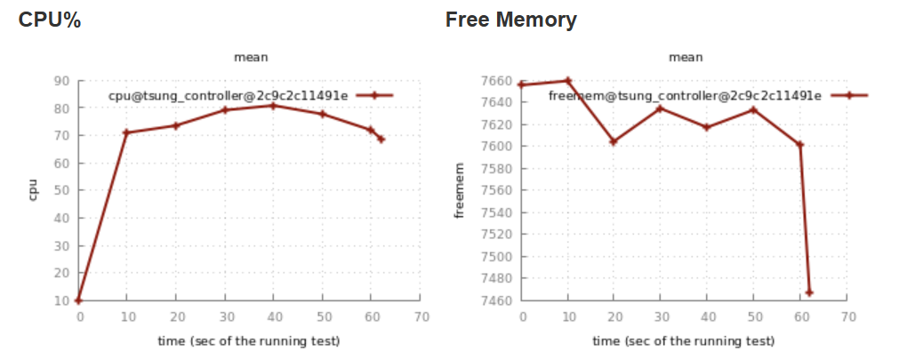
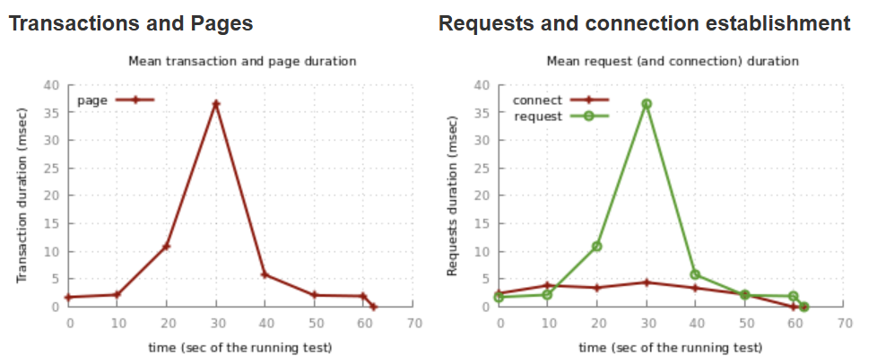
Общая картина показала, что узким местом является cpu,
поэтому необходимо увеличить количество ресурсов cpu

2) Избыточные конфигурации
- mem = 1g
- cpu = 2
При таких настройках было проведено нагрузочное тестирование
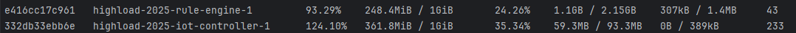
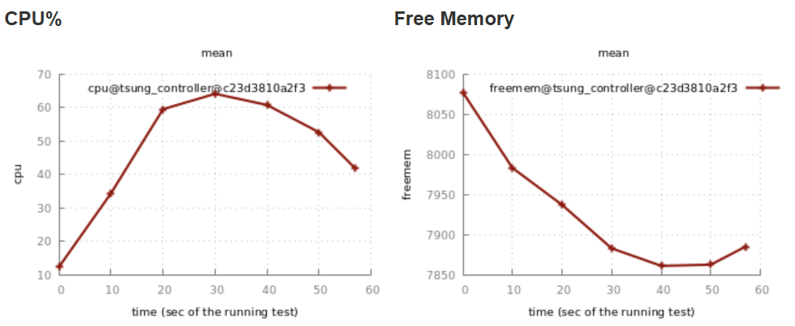
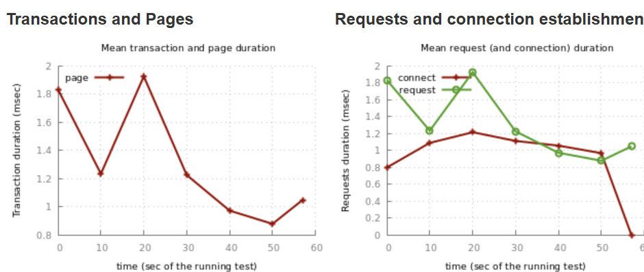
Как видим графики времени доступа перестали быть строго-возрастающими,
что говорит об отсутствии ограничений в ресурсах

### Горизонтальное масштабирование
Произведём горизонтальное масштабирование при помощи nginx
Мы расширяем количество реплик до 2. Каждой реплике выделено по:
- mem = 1g
- cpu = 1

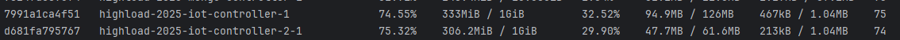
Из всех вариантов балансировки лучше всех подошёл least_conn:
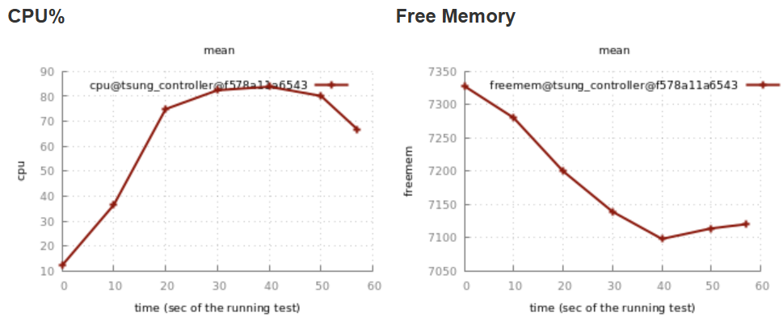
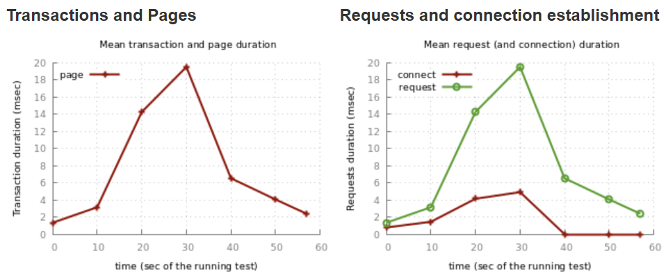
Скорее всего это вызвано тем, что однотипные данные, используемые в
тестировании имеют примерно одинаковое время обработки, из-за чего
балансировка least_conn делит нагрузку ~поровну, но в отличие от
round robin в случае подвисания сервиса его не будут закидывать новыми
соединениями

## Оптимизация хранения данных

### Redis
Для оптимизации хранения данных был использован redis-кеш,
который используется для кеширования запросов на сохранение
пакетов с одинаковой информацией в базе

Показатели при использовании горизонтального масштабирования и redis:

Видно что база фактически не задействована в работе:
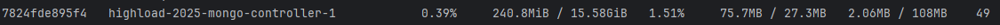
При этом показатели нагрузки остались на прежнем уровне:
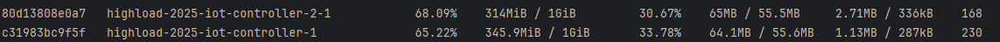
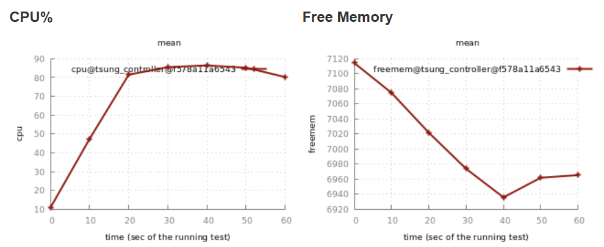
Видно, что график роста времени отклика стал более равномерным:
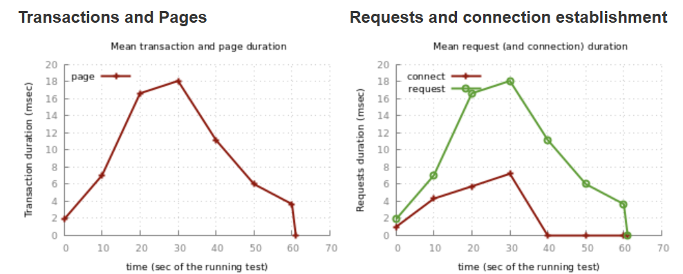

### Репликация и шардирование
Для реализации репликации и шардирования были использованы внутренние механизмы mongodb. Были созданы 3 реплики,
3 конфигурационных сервера и один контроллер mongos. Результаты нагрузочного тестирования:
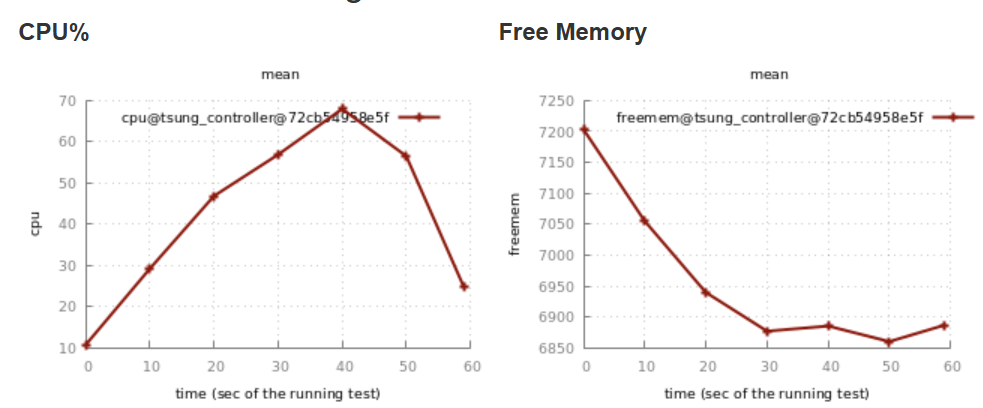
Можем видеть небольшое снижение затрат на cpu
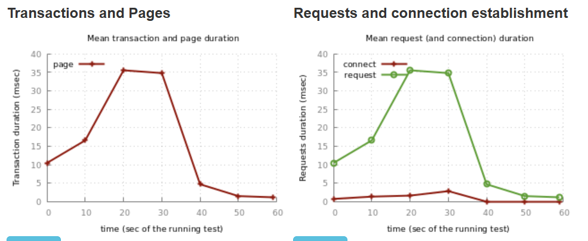
Есть тенденция на увеличение времени отклика, что может быть связано с необходимостью проксирования запросов через
mongos-контроллер
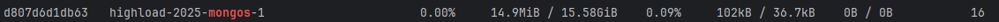
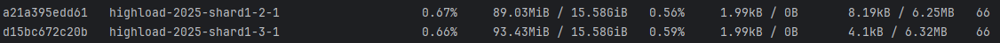
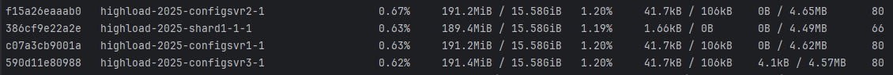
Также видна очень малая загруженность mongo, думаю это вызвано применением кеширования