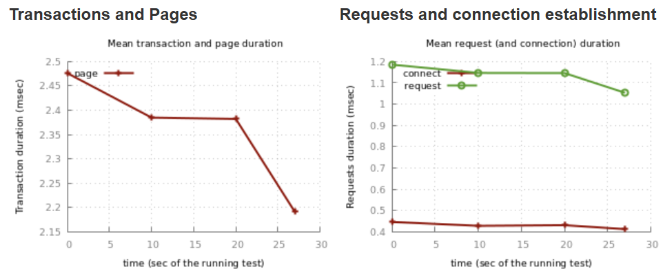
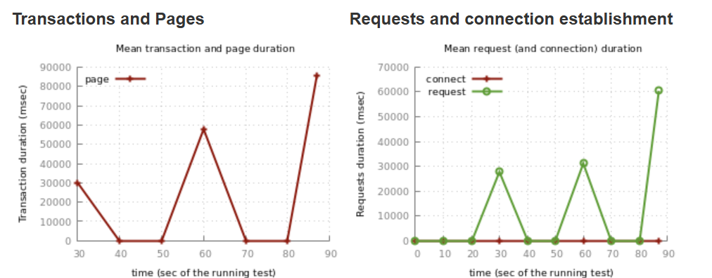

# IOT система

## Требования к системе

### 1. Максимальное количество пользователей, поддерживаемых в каждый момент времени:

- Ожидаемое количество одновременных сессий: 10000 (примерное количество устройств, которое может находиться в большом
  задании/офисе)
- Количество пользователей, активно взаимодействующих с приложением в реальном времени: 2000 (примерное количество
  сотрудников офиса, которые могут пользоваться iot единовременно)

### 2. Требуемая скорость обработки запросов:

- Время отклика на запросы пользователей (например, время ответа API): 2 секунды (приемлемое время откклика для
  человеческого восприятия)
- Время обработки запросов на уровне базы данных и взаимодействия между сервисами: 1.5 секунды (тк закладывается резерв
  под время обработки бизнесс логикой)

### 3. Объем хранимой информации:

- Прогнозируемый объем данных на старте: 0 (на с старте у приложения нет логов и данных)
- Возможный рост объема данных с течением времени, включая логи, пользовательские данные и контент: прирос 20 гб/час (
  расчитано на основе того, что один активный пользователь делает 1 запрос в секунду)
  

## Архитектура системы

Архитектура приложения состоит из трех сервисов: data-simulator, controller, rule-engine и инфраструктурных сервисов:
mongodb, mongo-express, rabbitmq, grafana, prometheus, elasticsearch, logstash, kibana. Собственные сервисы написаны на
языке программирования java с использованием фреймворка spring boot. Далее будут рассмотрены все сервисы.

### Собственные сервисы:

- data-simulator - сервис для генерации входных данных. Эмулирует поведение группы сервисов iot-системы отвечающих за
  генерацию данных в системе. В конфигурациях сервиса задается информация о количестве устройств, которые он эмулирует и
  частоте генерации ими сообщений, помимо этого есть возможность задать набор доступных имен и генерируемых значений.
  Генерируемые данные представляются в виде json-объектов с рандомным набором полей (из списка доступных полей) и
  значений.
- controller - сервис представляет собой входную точку в системе управления iot. Принимая данные от устройств (
  эмулируемые сервисом data-simulator), он валидирует их, сохраняет в mongodb, передает в очередь сообщений rabbitmq.
  Помимо этого
  используется для отслеживания метрик и состояния.

- rule-engine - сервис обработки входящих сообщений на выполнение динамически задаваемых правил. Принимает сообщения с
  помощью прослушивания очереди RabbitMQ, сохраняет результаты проверки в MongoDB.

### Инфраструктурные сервисы:

- mongodb/mongo-express - NoSQL база данных и интерфейс взаимодействия с ней. MongoDb была создана в двух экземплярах
  для сервисов controller и rule-engine. Сделано это было для сохранения принципа один сервис - одна база данных. Ниже
  будет приведена общая конфигурация для всех сервисов.
- rabbitmq - очередь обмена сообщениями, используемая для передачи пакетов данных от controller в rule-engine.
- grafana/prometheus - набор инструментов для работы с метриками. Grafana - инструмент для отображения данных,
  получаемых от datasource, в нашем случае datasource - это prometheus. Prometheus получает данные от каждого сервиса (
  для чего используется spring actuator). Все сервисы транслируют свои метрики одновременно, на grafana есть возможность
  указать данные какого сервиса необходимо мониторить. Среди прочих системных метрик есть отображение количества
  выполненных правил.
- elasticsearch/logstash/kibana - стек инструментов для хранения, обработки, фильтрации и визуализации логов.
  Elasticsearch - хранит логи по индексам. Logstash - принимает логи от beats, фильтрует и трансформирует их перед
  отправкой в elasticsearch. kibana - визуализирует логи, собирая их из elasticsearch. Каждый сервис подключен к этому
  стеку и отправляет туда логи по порту 5000. Для этого в logstash настроен пайплайн, который фильтрует по хосту.
- Redis - система управления NoSQL базами данных для работы с кэшами
- Tsung - система для проведения нагрузочного/стресс-тестирования 

### Нагрузочное тестирование:

  Для проведения нагрузочного тестирования была использована система tsung.
  Она была интегрирована в docker-compose и jenkins-pipeline.

  Было разработано 3 тестовых сценария которые должны использоваться как часть автотестов,
  для подтверждения корректной работы системы. Также был создан один сценарий стресс-тестирования,
  для получения информации о возможных узких местах.

  Отчёты были сгенерированы автоматически с использованием tsung_stats.pl.

  В первую очередь рассмотрим 3 базовых сценария интегрированных в Jenkins:

- Сценарий 1: много пользователей, низкая частота (10 пользователей/сек, 1 запросов/сек, 30 секунд)
- Сценарий 2: мало пользователей, высокая частота (1 пользователей/сек, 10 запросов/сек, 30 секунд)
- Сценарий 3: пиковая нагрузка (10 пользователей/сек, 10 запросов/сек, 30 секунд)

#### Время отклика (Response Time)

  Как видно диаграмма Transactions and Pages во всех трёх нагрузках остаётся примерно неизменной
  Также видно, что время установления соединений и выполнения запроса также стабильно во всех трёх случаях

  
  
  

#### Пропускная способность (Throughput)

  Как видно из графиков пропускная способность системы во всех трёх видах нагрузки не изменяется

  
  
  

### Стресс тестирование
- Сценарий 4: стресс нагрузка (100 пользователей/сек, 100 запросов/сек, 30 секунд)

  Сценарий был создан для максимальной загрузки систем, с целью достичь отказа.
  Полученная информация будет использоваться для подтверждения успешности масштабирования
  и кеширования на следующих стадиях.

  
  
